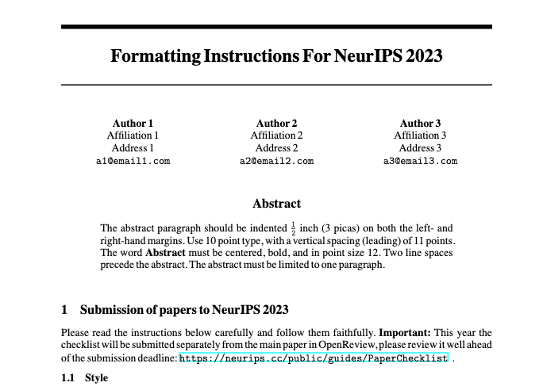

# AI conference templates in [Typst](https://typst.app/)

Templates for AI conferences (or many other conference) are historically written only in LaTeX, which is old and hard to use. [Typst](https://typst.app/) is a modern typesetting system with a much more familiar programming model. As the community grows, we may want to use Typst for writing papers in the conferences. Please note that **this is an individual effort to port the templates, but not "officially" supported by the conferences**. Also, this repo is still work in progress and might not yet match the exact specification (e.g. margin, styling) of the conference.


### The goal of this project is roughly
1. Port AI conference templates in Typst
2. Make them look and feel similar to their LaTeX versions
3. Follow the exact specifications provided by the conference

---

### List of conferences

- [X] NeurIPS
- [ ] ICML
- [ ] ICLR
- [ ] CVPR
- [ ] ICCV
- [ ] ECCV
- (more to come)

---

### Interface

The idea is to have a (roughly) fixed `#show: ...` rule for each conference. Putting the following at the beginning of the paper will act as a "template" ..

```
#import "neurips.typ": manuscript

#show: manuscript.with(
    title: [Formatting Instructions For NeurIPS 2023],
    authors: (
        [
            *Anonymous Author(s)*\
            Affiliation\
            Address\
            `email`
        ],
    ),
    abstract: [
        The abstract paragraph should be indented $1/2$~inch (3~picas) ..
    ]
)
```

.. and produces PDF like this

<center>
    
</center>